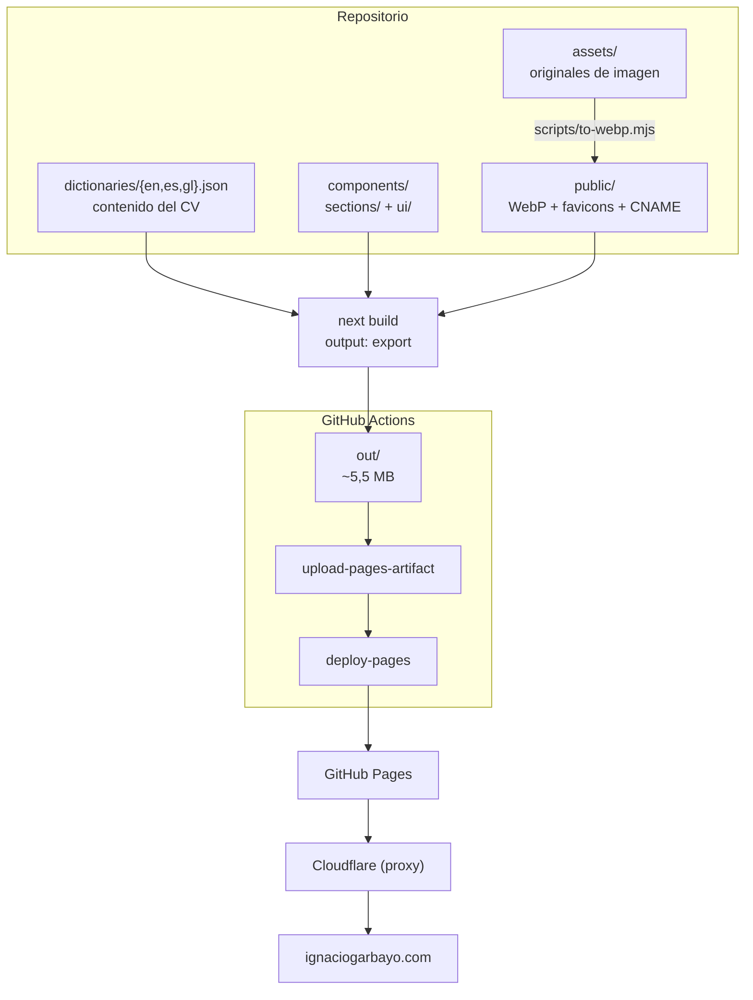

# web-personal

<!--
Badges pendientes de registrar el proyecto en cada plataforma. Descoméntalos
cuando exista el registro; hasta entonces devolverían una imagen rota.
  - REUSE:                  https://api.reuse.software/  (requiere REUSE.toml y LICENSES/)
  - OpenSSF Best Practices: https://www.bestpractices.dev/  (cuestionario de autoevaluación)
  - OpenSSF Scorecard:      https://scorecard.dev/  (requiere repositorio público)

[](https://api.reuse.software/info/github.com/igarbayo/web-personal)
[](https://www.bestpractices.dev/projects/PROJECT_ID)
[](https://scorecard.dev/viewer/?uri=github.com/igarbayo/web-personal)
-->

CV web personal de Ignacio Garbayo Fernández, publicado en **[ignaciogarbayo.com](https://ignaciogarbayo.com)**.

Un CV en PDF no se indexa, no se actualiza sin reenviarlo y no se lee bien en un móvil. Este repositorio resuelve eso con un sitio estático trilingüe (inglés, español y gallego) que se despliega solo en cada push a `main`, funciona sin JavaScript de terceros y se sirve desde un dominio propio con analíticas server-side.

El contenido no vive en el código: está en tres ficheros JSON, uno por idioma. Añadir un curso o una experiencia es editar JSON, no tocar componentes.

## Características

| | |
|---|---|
| **Trilingüe** | Inglés, español y gallego, sin librería de i18n: rutas `/[lang]` y diccionarios JSON |
| **Estático** | `output: 'export'` — HTML plano, sin servidor ni base de datos |
| **Modo oscuro** | Sigue la preferencia del sistema, con toggle manual persistente y sin parpadeo inicial |
| **Contenido en datos** | Todo el CV en `dictionaries/*.json`; los componentes solo lo pintan |
| **Imágenes optimizadas** | WebP generado desde los originales, que quedan fuera del artefacto de deploy |
| **Deploy automático** | GitHub Actions → GitHub Pages en cada push a `main`, ~60 s |
| **Verificación local** | Hooks de git con lint, typecheck, build y comprobaciones propias |

## Arquitectura



Dos decisiones que explican el resto del diseño:

- **`assets/` no es `public/`.** Next copia `public/` entera al export, y ese export es el artefacto que se despliega. Los originales de imagen (JPG de cámara, PNG previos a la conversión) viven en `assets/`, fuera del build; solo el WebP resultante entra en `public/`. Sin esa separación el artefacto pesaba 46 MB y el despliegue se encallaba.
- **Cloudflare va por delante de GitHub Pages.** GitHub Pages no da métricas de visitas; con el dominio proxied, todo el tráfico pasa por el edge de Cloudflare y queda registrado sin depender de JavaScript ni de que el visitante tenga bloqueadores.

## Instalación

Requiere **Node.js 20+** y **pnpm** (el proyecto no usa npm).

```bash
git clone https://github.com/igarbayo/web-personal.git
cd web-personal/src/frontend
pnpm install
```

Activa los hooks de git, que no se activan solos al clonar:

```bash
cd ../..
git config core.hooksPath .githooks
```

## Uso

Todos los comandos se lanzan desde `src/frontend/`.

```bash
pnpm dev        # servidor de desarrollo en localhost:3000 (redirige a /en)
pnpm check      # verify + lint + typecheck (~5 s)
pnpm build      # export estático a out/
```

### Añadir una entrada al CV

El caso más frecuente. Edita los tres diccionarios y no toques nada más:

```jsonc
// src/frontend/dictionaries/en.json → experience.entries[]
{
  "date": "07/2026",
  "title": "Research Intern",
  "company": "[CiTIUS](https://citius.gal/)",
  "bullets": ["Summer Research Fellow, focused on Computer Vision."],
  "logo": ["citius.webp"],
  "logoDark": ["citius-white.webp"]
}
```

Convenciones que `pnpm verify` comprueba: los años van completos (`07/2026`, nunca `07/26`) y las tres traducciones deben existir. El campo `date` admite varios rangos separados por ` & ` para estancias discontinuas.

### Añadir una imagen

```bash
cp foto.jpg src/frontend/assets/          # el original va a assets/
# añade 'foto.jpg' al array FILES de scripts/to-webp.mjs
node scripts/to-webp.mjs                  # genera public/foto.webp
# registra sus dimensiones en lib/imageDimensions.ts (lo exige next/image)
```

Después referencia **`foto.webp`** desde el diccionario, nunca el original.

## Configuración

| Fichero | Qué controla |
|---|---|
| `src/frontend/next.config.js` | `output: 'export'` y `trailingSlash: true` |
| `src/frontend/tailwind.config.ts` | Tokens de color, `darkMode: 'class'` |
| `src/frontend/app/globals.css` | Paleta clara y oscura como variables CSS en canales RGB |
| `src/frontend/public/CNAME` | Dominio personalizado de GitHub Pages |
| `.github/workflows/deploy.yml` | Build y despliegue en cada push a `main` |
| `.githooks/` | `pre-commit` (check) y `pre-push` (build) |

## Compatibilidad

| Entorno | Estado |
|---|---|
| Node.js 20, 22 | Probado — el workflow usa 20; el runner ya fuerza 24 |
| pnpm 9 | Probado — versión fijada en el workflow |
| Navegadores modernos | Probado en Chrome, Safari y Firefox, escritorio y móvil |
| Sin JavaScript | Contenido legible; el toggle de tema y el menú móvil no funcionan |

El punto de corte entre móvil y escritorio es el breakpoint `sm` de Tailwind, **640 px**. En iOS, «Solicitar sitio de escritorio» cambia el user agent y el ancho de viewport, pero girar el teléfono a horizontal es más fiable para revisar el diseño ancho.

## Solución de problemas

| Problema | Causa y arreglo |
|---|---|
| El deploy falla con `Timeout reached, aborting!` | El despliegue se queda en `deployment_queued`. Mira el tamaño de `out/`: por encima de unos pocos MB, Pages tarda más de los 10 minutos que `deploy-pages` espera como máximo (el límite está cableado en la acción y no se puede subir). Comprueba que no se haya colado ningún original en `public/`; `pnpm verify` lo detecta. |
| Relanzar un deploy fallido da `Multiple artifacts named "github-pages"` | Un *re-run* reutiliza la misma ejecución y vuelve a subir el artefacto, dejando dos. Ese run ya no se recupera: haz un commit nuevo para generar una ejecución limpia. |
| Los hooks no se ejecutan | `core.hooksPath` es configuración local de cada clon y no viaja en el repo. Ejecuta `git config core.hooksPath .githooks`. |
| Un hook falla con «falta node_modules» | Ejecuta `pnpm install` dentro de `src/frontend`. Para saltar los hooks puntualmente, `SKIP_HOOKS=1` delante del comando. |
| `pnpm verify` dice que falta una imagen en `public/` | Moviste el original a `assets/` pero no generaste el WebP. Lanza `node scripts/to-webp.mjs`. |
| Una URL sin barra final da 404 | Lo resuelve `trailingSlash: true` en `next.config.js`, que genera `en/index.html` en vez de `en.html`. Si vuelve a pasar, comprueba que esa opción sigue puesta. |
| El modo oscuro se pierde al cambiar de idioma | Cambiar de idioma es navegación cliente y re-renderiza `<html>`, pisando la clase `.dark`. Lo reaplica `components/ThemeSync.tsx`; si falla, comprueba que sigue montado en el layout. |

## Soporte

¿Dudas, fallos o ideas? Abre un [issue en GitHub](https://github.com/igarbayo/web-personal/issues).
