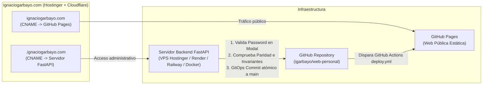

# Guía de Arquitectura, Uso y Despliegue en Subdominio del CMS

El CMS de **ignaciogarbayo.com** es un gestor de contenidos trilingüe (Español, Inglés, Gallego) diseñado para vivir en un **subdominio secreto** (`https://<subdominio>.ignaciogarbayo.com`), desacoplado del sitio estático principal en GitHub Pages y con máxima seguridad.

---

## 1. Arquitectura de Despliegue en Subdominio



### Ventajas de este esquema:
1. **Ocultación total en Open Source:** Nadie que visite el repositorio público o la web pública `ignaciogarbayo.com` sabe qué subdominio existe.
2. **Web pública 100% limpia:** El bundle estático de `ignaciogarbayo.com` en GitHub Pages no contiene código administrativo ni rutas del CMS.
3. **Servidor Todo-en-Uno en el Subdominio:** El servidor FastAPI aloja tanto la interfaz web del CMS (en `/`) como la API REST (en `/api/v1`), facilitando el despliegue a un único contenedor Docker o servicio.

---

## 2. Configuración en Hostinger y Cloudflare

### Paso 1: Configurar el Registro DNS en Cloudflare
Dado que el dominio está registrado en Hostinger y gestionado por Cloudflare:
1. Accede a tu panel de **Cloudflare** -> Selecciona `ignaciogarbayo.com` -> **DNS** -> **Records**.
2. Añade un nuevo registro:
   - **Tipo:** `CNAME` (o `A` si usas IP directa de VPS)
   - **Nombre:** Tu subdominio secreto elegido (ejemplo: `panel-k98x` o `cms-ignacio`)
   - **Destino:** El dominio de tu servidor (ej. `mi-backend.onrender.com` o la IP de tu VPS en Hostinger)
   - **Proxy status:** `Proxied` (Nube naranja activada para SSL automático y protección contra ataques)

---

## 3. Puesta en Marcha en Desarrollo Local

### Paso 1: Iniciar el Backend (FastAPI)
```bash
cd src/backend

# Instalar dependencias
pip install -r requirements.txt

# Iniciar servidor FastAPI
python -m uvicorn app.main:app --host 0.0.0.0 --port 8000 --reload
```
Verifica su estado en `http://localhost:8000/health`.

### Paso 2: Compilar o Iniciar la UI del CMS
Para desarrollo en local con Hot Reload:
```bash
cd src/frontend
pnpm dev
```
Accede a `http://localhost:3000/admin`.

Para generar la compilación estática que el backend de FastAPI servirá directamente en el subdominio:
```bash
cd src/frontend
pnpm build:cms
```
Esto genera los archivos estáticos en `src/backend/static/`. Al abrir `http://localhost:8000/`, verás el CMS servido directamente por FastAPI.

### Credenciales por Defecto (Desarrollo):
- **Usuario:** `ignacio`
- **Contraseña:** `admin1234`

---

## 4. Despliegue en Render.com (Paso a Paso)

Render es ideal para alojar el backend de FastAPI en su capa gratuita o básica:

### Paso 1: Generar tu Personal Access Token en GitHub
1. Ve a GitHub -> **Settings** -> **Developer Settings** -> **Personal access tokens** -> **Fine-grained tokens** (o Tokens Classic).
2. Pulsa en **Generate new token**:
   - **Repository access:** Selecciona solo `igarbayo/web-personal`.
   - **Permissions:** `Contents` -> `Read and write`.
3. Copia el token generado (`ghp_...`).

### Paso 2: Crear el Web Service en Render
1. Inicia sesión en [Render.com](https://render.com) y pulsa en **New +** -> **Web Service**.
2. Conecta tu repositorio de GitHub `igarbayo/web-personal`.
3. Configura los campos del servicio:
   - **Name:** `garden-personal-cms` (o el nombre que elijas)
   - **Region:** `Frankfurt (EU Central)`
   - **Branch:** `main`
   - **Root Directory:** `src/backend`
   - **Runtime:** `Docker` (usará automáticamente el `Dockerfile` de `src/backend`)
   - **Instance Type:** `Free`
4. Añade las **Environment Variables** en Render:
   - `ENVIRONMENT` = `production`
   - `ADMIN_USERNAME` = `ignacio`
   - `ADMIN_PASSWORD_HASH` = El hash bcrypt de tu contraseña maestra (generado con `python -c "import bcrypt; print(bcrypt.hashpw(b'tu_pass', bcrypt.gensalt()).decode())"`)
   - `JWT_SECRET` = Una cadena aleatoria larga y segura
   - `GITHUB_TOKEN` = Tu token `ghp_...` del Paso 1
   - `GITHUB_REPO` = `igarbayo/web-personal`
   - `GITHUB_BRANCH` = `main`
   - `CMS_SUBDOMAIN` = El nombre de tu subdominio secreto (ej. `panel-k98x`)
   - `PORT` = `8000`
5. Pulsa en **Create Web Service**.

### Paso 3: Asignar tu Subdominio en Cloudflare
1. En el panel de Render, entra en tu Web Service -> pestaña **Settings** -> **Custom Domains**.
2. Añade `tu-subdominio.ignaciogarbayo.com`. Render te dará la URL de destino (ej. `garden-personal-cms.onrender.com`).
3. Ve a tu panel de **Cloudflare DNS** de `ignaciogarbayo.com` y crea un registro:
   - **Tipo:** `CNAME`
   - **Nombre:** `tu-subdominio`
   - **Target:** `garden-personal-cms.onrender.com`
   - **Proxy status:** `Proxied` (Nube naranja)
4. En 1-2 minutos, Cloudflare y Render emitirán el certificado SSL. Ya podrás entrar a `https://tu-subdominio.ignaciogarbayo.com/` para gestionar toda tu web.

---

## 5. Funcionalidades del CMS y Flujo de Edición

1. **Editor Trilingüe Simultáneo:** Edita campos en Español, Inglés y Gallego en paralelo con avisos de paridad en tiempo real.
2. **Modal de Confirmación con Contraseña:** Cada vez que pulses *"Publicar Cambios"* o modifiques imágenes/entradas, un modal te mostrará el resumen del diff y te exigirá la contraseña maestra.
3. **Gestor de Medios:** Subida de imágenes con auto-conversión a `.webp` (calidad 85%) y monitor del presupuesto de **8 MB**.
4. **Verificación de Invariantes:** Si un año no tiene 4 cifras (`MM/YYYY`), si falta una traducción o si se sobrepasa el presupuesto de peso, el backend rechaza el cambio y detalla el motivo exacto, protegiendo el despliegue en producción.
